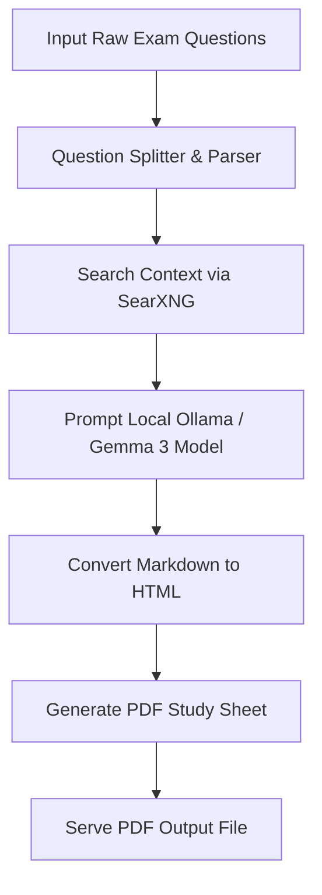

## Objective & Design Philosophy
Studying for judicial services and university law examinations requires synthesizing questions with relevant case law, statutory provisions, and summaries of court decisions. While public AI APIs (such as OpenAI or Google Cloud) can compile this information, they present data privacy concerns for sensitive exam preparation materials. They are also prone to hallucinations when dealing with region-specific statutory acts, like the Indian Penal Code (IPC) or specific state ordinances.

This application provides a self-hosted legal-tech batch processor. It parses lists of exam questions, retrieves search context, runs local LLM inference, and generates structured PDF study sheets offline.

---

## Technical Architecture & Retrieval-Augmented Generation (RAG) Flow



The application implements a local **Retrieval-Augmented Generation (RAG)** pipeline to synthesize responses:
1. **Input Parsing:** Users submit raw question sheets via a web form. The Flask backend splits questions into independent queries.
2. **Context Querying:** The processor executes queries against a local, privacy-respecting **SearXNG** metasearch engine instance. This queries search engines in parallel, gathering context from legal databases and case archives.
3. **Local Inference:** The extracted text snippets are injected into a structured prompt context. This context is sent to a local **Ollama** runtime running the Google Gemma 3 model. The model reasons over the documents to generate legal analyses, complete with citations and arguments.
4. **Document Compilation:** The markdown output is processed by **Pandoc** and compiled into a styled PDF document using the **wkhtmltopdf** engine.

---

## Detailed System Requirements

### Hardware Specs
- **OS:** Linux (recommended) or macOS.
- **CPU:** Apple Silicon (M1/M2/M3) or modern multi-core Intel/AMD x86-64 processors.
- **RAM:** Minimum 8 GB required; 16 GB or higher is recommended for smooth model token generation speeds.
- **Storage:** Solid State Drive (SSD) with at least 15 GB of free space to store local LLM model weights.

### Software Stack
- **Backend Framework:** Python 3.10+ running a Flask web server.
- **Local Inference Engine:** Ollama running `gemma3:4b` weights (optimized for local deployment).
- **Metasearch Interface:** Self-hosted SearXNG instance configured to output JSON data payloads.
- **Rendering Libraries:** Pandoc (document conversion) and wkhtmltopdf (system tool for converting layouts to PDF).

---

## API Design & Endpoints

The Flask server hosts the following RESTful API structure to manage processing jobs:

| Endpoint | Method | Input Parameters | Output Payload | Operational Purpose |
| --- | --- | --- | --- | --- |
| `/exam` | `POST` | JSON array of raw questions | `{ "task_id": "uuid" }` | Submits batch questions to the queue and starts processing. |
| `/progress/<task_id>` | `GET` | URL Parameter: `task_id` | `{ "status": "processing/done", "percent": 75 }` | Polls the processing status of a batch job. |
| `/download/pdf/<name>` | `GET` | URL Parameter: `file_name` | Raw Binary PDF stream | Downloads the final generated study sheets. |

---

## Installation & Deployment Guide

### Step 1: Install System Dependencies
Install Pandoc and wkhtmltopdf using system package managers:
```bash
sudo apt update
sudo apt install pandoc wkhtmltopdf
```

### Step 2: Setup Python Virtual Environment
Clone the repository, initialize the virtual environment, and install dependencies:
```bash
python3 -m venv venv
source venv/bin/activate
pip install flask requests ollama
```

### Step 3: Configure Ollama Runtime
Start the local Ollama daemon and pull the Gemma 3 model:
```bash
ollama pull gemma3:4b
```

### Step 4: Configure SearXNG
Ensure your self-hosted SearXNG instance is running and has the JSON format output engine enabled in its config files. Update the backend application variables to point to the SearXNG endpoint.

### Step 5: Run the Server
Launch the Flask server:
```bash
python app.py
```
Open a browser and navigate to `http://localhost:5000` to access the UI.

## Code Link
- [View law-exam-batch-processor on GitHub](https://github.com/maniratansingh/law-exam-batch-processor) ↗

---
← [Back to GitHub Projects](/github/)
