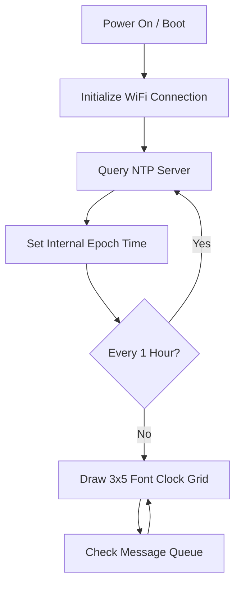

## Objective & Design Philosophy
Standard home clocks are dumb appliances: they run on batteries that wear out, drift drift over time, and require manual resetting whenever Daylight Saving Time changes. 

This project redefines the household clock as an autonomous, self-sufficient smart appliance. Utilizing a low-cost Wi-Fi microcontroller, it synchronizes time over network sockets using NTP (Network Time Protocol) servers to ensure accuracy. In addition to displaying time, it functions as an info terminal, showing morning weather forecasts, scrolling customized reminders, and serving a configuration dashboard over the local network.

---

## Detailed Hardware Breakdown & Component Usage

### 1. Microcontroller: ESP8266 (NodeMCU / Wemos D1 Mini)
- **Core Processor:** Tensilica L106 32-bit RISC processor running at 80 MHz.
- **Role:** Handles Wi-Fi network handshakes, executes the NTP time synchronization routines, calls external weather endpoints over HTTP, processes calendar schedules for holiday triggers, and hosts a web dashboard server.
- **Peripherals:** Built-in TCP/IP stack with integrated 2.4 GHz transceiver.

### 2. Display: MAX7219 4-in-1 Dot Matrix Display
- **Specifications:** 4 cascaded 8x8 LED matrix modules forming a 32x8 grid of red LEDs.
- **Role:** Displays hours and minutes using a space-optimized 3x5 font, animates blinking seconds indicators, and displays scrolling text messages.
- **Display Driver Interface:** Communicates using hardware SPI interfaces, allowing rapid frame writes and brightness configuration over single instruction sets.

---

## Electrical Pin Configuration & Wiring

The ESP8266 connects to the MAX7219 driver board using the following hardware SPI and GPIO pin mapping:

| ESP8266 Board Pin | ESP8266 GPIO Designation | MAX7219 Board Pin | Signal / Electrical Purpose |
|---|---|---|---|
| **5V / VU** | `5V / VCC` | **VCC** | Power supply (5V is recommended over 3.3V for full LED brightness) |
| **GND** | `GND` | **GND** | Common Ground connection |
| **D7** | `GPIO13` | **DIN** | Hardware SPI MOSI (Master Out Slave In) serial data stream |
| **D5** | `GPIO14` | **CLK** | Hardware SPI SCK (Serial Clock Line) driven by microcontroller |
| **D2** | `GPIO4` | **CS / LOAD** | GPIO Chip Select line used to latch data frames into the registers |

---

## Operational Architecture & System Software Loops

### Time Synchronization Architecture
The clock syncs time via network sockets:
1. **Boot Handshake:** During initialization, the device opens a UDP connection on port 123 to a designated pool server (e.g. `pool.ntp.org`).
2. **NTP Packet Extraction:** The clock extracts raw Unix Epoch seconds from the NTP packet, calculates the offsets for India Standard Time (IST - UTC+5:30), and sets the internal clock counters.
3. **Local Maintenance:** Time is incremented locally using internal hardware timers. The clock re-syncs with NTP every hour to prevent local clock drift.

### Weather Retrieval Engine
Every morning at a scheduled time, the ESP8266 initiates an HTTP request to the Open-Meteo REST API using geographic coordinates. The payload returns a JSON response containing temperature, relative humidity, wind speed, and weather codes. The clock parses this stream using the `ArduinoJson` parser library, formatting the results into a scrollable text banner.

### Captive Portal & Local Server
If the clock is powered on and cannot connect to the last-saved access point, the firmware uses the `WiFiManager` module to host a local access point. Users can connect to this network from their phone, load a captive portal configuration page, choose local access points from a list, and save credentials to EEPROM without reflashing code.

---

## Remote Control Web Dashboard
Once connected, the local IP address of the clock is displayed on the serial console. Navigating to this address in a local browser opens a web interface. The dashboard allows users to:
- Check current runtime statistics, system memory availability, and network signal strength (RSSI).
- Queue temporary text messages to be scrolled across the LED screen immediately.
- Toggle display orientation (flip display layout by 180 degrees depending on mounting requirements).
- Modify display brightness levels dynamically.

## Code Link
- [View wificlock repository on GitHub](https://github.com/maniratansingh/wificlock) ↗

---
← [Back to GitHub Projects](/github/)
