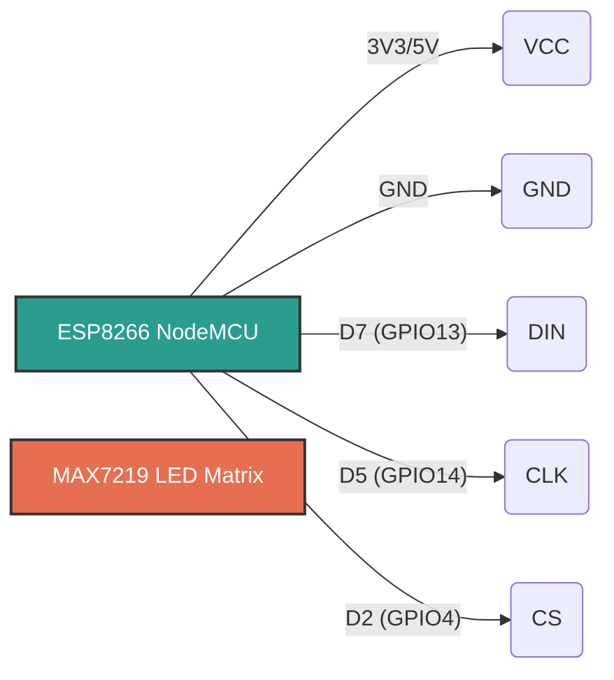

# ESP8266 Smart LED Matrix Clock

An feature-rich smart clock built on the ESP8266 (NodeMCU/Wemos D1 Mini) utilizing a MAX7219 LED matrix. It features NTP time synchronization, morning weather updates, custom birthday/holiday messages, and a complete Web Dashboard for remote control.

## Features
- **Accurate Clock**: NTP time sync (IST UTC+5:30) with a custom 3x5 font and seconds animation.
- **Weather Updates**: Connects to the Open-Meteo API for temperature, humidity, wind, and smart advisories.
- **Web Dashboard**: Modern mobile-responsive interface to view system status, queue messages, toggle screen orientation, and test events.
- **Smart Scrolling Engine**: Smooth horizontal scrolling for long text across the 4 matrices.
- **Holidays & Birthdays**: Built-in dates trigger automatic greetings on the matrix.

## Circuit Diagram

Connect your ESP8266 to the MAX7219 matrix module as follows:

| ESP8266 (NodeMCU) | MAX7219 Pin | Notes |
|-------------------|-------------|-------|
| 3V3 / 5V          | VCC         | 5V recommended for best brightness |
| GND               | GND         | Common Ground |
| D7 (GPIO13)       | DIN         | Data In |
| D5 (GPIO14)       | CLK         | Clock |
| D2 (GPIO4)        | CS / LOAD   | Chip Select |



## Setup & Installation

1. **Hardware**: Wire the MAX7219 matrix to the ESP8266 according to the diagram above.
2. **Software**: 
   - Install the ESP8266 core for Arduino in your IDE.
   - Install the `MD_MAX72XX` library via the Library Manager.
3. **Configuration**:
   - Open `wificlock.ino`.
   - Update your Wi-Fi credentials:
     ```cpp
     const char* WIFI_SSID = "YOUR_SSID";
     const char* WIFI_PASS = "YOUR_PASSWORD";
     ```
   - Make sure `#define HARDWARE_TYPE MD_MAX72XX::FC16_HW` matches your physical matrix type.
4. **Flash**: Upload to your ESP8266.
5. **Dashboard**: Once connected to WiFi, the serial monitor will print the local IP address. Navigate to `http://<YOUR_IP>` in any browser.


***

### Code Link
- [View Original Repository on GitHub](https://github.com/maniratansingh/wificlock) ↗

***
← [Back to Projects](/projects/)
